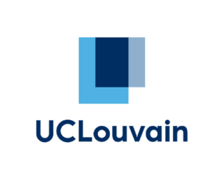

Hello, I am Victor. I am a PhD student at  in Data Science with a interest on graphs neural networks (GNN) and Generative models. Feel free to have a look to my different public repos ! 😁

- 🔗 LinkedIn: [Victor Dujardin](https://www.linkedin.com/in/victor--dujardin/)

I prinipally use R and python for my different projects.

